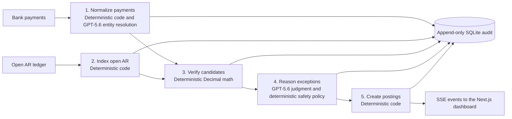

# Ledger Sense Architecture

This is the current technical reference for Ledger Sense. Its source of truth is the running code: `backend/reconciliation.py`, `backend/main.py`, and `frontend/app/page.js`.

## System overview

Ledger Sense is a reasoning layer for the ambiguous portion of AR cash application. It accepts synthetic bank payments and an Open AR ledger, verifies allocations with deterministic accounting code, uses GPT-5.6 for bounded entity and routing judgment, and records every decision in an append-only SQLite journal.

The data flow is intentionally simple.

1. Bank payments enter normalization. The Open AR ledger enters indexing.
2. Normalized payments and the indexed ledger are used to verify candidate allocations.
3. Verified candidates are passed to exception reasoning.
4. The final safe route becomes a deterministic posting instruction.
5. Every stage writes an append-only SQLite audit event. The final posting instruction is streamed to the Next.js dashboard through SSE.

## Five-agent breakdown

| Agent | Inputs and outputs | Implementation | Boundary | Example |
| --- | --- | --- | --- | --- |
| 1. Normalize payments | Raw transaction becomes normalized amount, currency, remittance, entity, relationship, confidence, and rationale | `run_pipeline()`, `entity_catalog()`, `resolve_entity()` in `backend/reconciliation.py` | Deterministic normalization. GPT-5.6 chooses only from ledger-supplied entities. | `TXN-04-005`: `T&R TRADING CO` resolves to the documented DBA for Thornton and Reed Enterprises |
| 2. Index open AR | Ledger invoices, aliases, and relationship registries become an invoice index and entity catalog | `run_pipeline()`, `entity_catalog()` | Deterministic | Sample 04 makes parent, factoring, and intercompany relationships available to later stages |
| 3. Verify candidates | Normalized payment and indexed invoices become ordered, balanced candidate allocations and amount facts | `candidates()`, `amount_facts()`, `fx_verified()` | Deterministic `Decimal` math only | `TXN-01-002` is verified as a multi-invoice sum before any model routing |
| 4. Reason exceptions | Grounded entity result, candidates, and deterministic facts become a route, confidence, and analyst rationale | `reason()`, `deterministic_policy()`, `enforce_auto_post_safety()` | GPT-5.6 judges ambiguity. Policy and safety enforcement are hard gates. | `TXN-03-001` is compliance-held even if the model would otherwise recommend posting |
| 5. Create postings | Final safe route and verified allocation become a posting instruction and SSE result | `run_pipeline()` | Deterministic | `TXN-01-001` emits a posting only after the exact allocation is verified |

## How agents communicate

`POST /analyze` in `backend/main.py` creates a run ID and consumes the async generator `run_pipeline()`. Each yielded event is serialized as an SSE `data:` message. The frontend reads that stream in `frontend/app/page.js` and marks stage badges complete or appends a posting card.

The frontend sends a `POST /analyze` request. The backend responds with SSE messages in this order:

1. `normalize` starts and completes. Each entity-resolution result is also reported.
2. `ledger_index` starts and completes.
3. `match` completes for each transaction.
4. `posting` completes for each transaction and carries the result card data.
5. `exception_reasoning` completes after all routing decisions are final.
6. `complete` carries the full result collection.

Within the pipeline, each stage passes structured Python dictionaries to the next stage. The model receives only the current payment, ledger-grounded entity context, verified candidates, and deterministic amount facts; it never receives authority to create a new allocation.

## Safety architecture

### Deterministic accounting

All amounts use Python `Decimal`. Candidate verification covers invoice totals, partial balances, discounts, multi-invoice sums, credit memo netting, fee thresholds, duplicates, and FX conversion facts. GPT-5.6 does not calculate money or create invoice IDs.

### GPT-5.6 judgment

The standard OpenAI Python SDK calls `AsyncOpenAI.responses.create(model="gpt-5.6")` for two constrained tasks: `resolve_entity()` and `reason()`. Entity resolution is limited to customer and alias candidates supplied by the ledger. Routing returns structured JSON for `auto_post`, `review`, `dispute`, or `compliance_hold` plus a confidence and concise rationale.

### Hard gates

`deterministic_policy()` blocks explicit compliance/legal holds, disputed invoices, duplicates, NSF returns, post-dated checks, and stale checks. `enforce_auto_post_safety()` is the last gate.

#### Worked safety example: unsafe auto-post prevention

An earlier defect allowed GPT-5.6 to recommend `auto_post` when no verified invoice was available. The root cause was that `PARTIAL` invoices were excluded from matching and the model route had no final allocation gate. The fix makes remaining balances on `PARTIAL` invoices eligible and forces every model `auto_post` recommendation to `review` unless a deterministic candidate has at least 95 percent confidence. Regression tests cover this case; all ten samples were audited with no unsafe auto-post remaining.

## Edge-case coverage (34 total)

The original category counts total 34 scenarios. All are represented with synthetic data and map to the following sample transactions.

### Amount mismatches

| Scenario | Sample transaction |
| --- | --- |
| Exact match | `TXN-01-001` |
| Multi-invoice | `TXN-01-002` |
| Early-pay discount | `TXN-01-003` |
| Unauthorized short pay | `TXN-02-005` |
| Freight deduction | `TXN-02-002` |
| Damage claim | `TXN-02-003` |
| Overpayment | `TXN-08-001` |
| Credit memo net | `TXN-08-002` |
| Wire-fee write-off | `TXN-01-004` |
| Late discount taken | `TXN-02-007` |

### Identity and name

| Scenario | Sample transaction |
| --- | --- |
| SWIFT 35-character truncation | `TXN-09-001` |
| DBA name | `TXN-09-002` |
| Post-acquisition name change | `TXN-09-003` |
| Fuzzy name alias | `TXN-09-007` |

### Multi-entity

| Scenario | Sample transaction |
| --- | --- |
| Parent pays for subsidiary | `TXN-04-001` |
| Third-party factoring agent | `TXN-04-002` |
| Intercompany netting | `TXN-04-003` |
| Wrong legal entity redirect | `TXN-03-003` |

### Timing and sequencing

| Scenario | Sample transaction |
| --- | --- |
| Duplicate payment detection | `TXN-06-005` |
| Installment / partial payment | `TXN-01-007` |
| NSF return and reversal | `TXN-06-003` |
| Post-dated check hold | `TXN-06-001` |
| Stale check return | `TXN-06-002` |
| Prepayment / advance deposit | `TXN-06-007` |

### Remittance and reference

| Scenario | Sample transaction |
| --- | --- |
| No remittance followed by FIFO match | `TXN-01-005` |
| Vague remittance followed by amount match | `TXN-07-002` |
| PO number reference | `TXN-01-006` |
| Legacy ERP invoice number | `TXN-07-003` |
| EDI 820 remittance pending | `TXN-07-004` |

### FX and international

| Scenario | Sample transaction |
| --- | --- |
| Foreign-currency payment | `TXN-05-001` |
| FX-rate verification | `TXN-05-003` |

### Compliance and legal

| Scenario | Sample transaction |
| --- | --- |
| OFAC / sanctions hold | `TXN-03-001` |
| Disputed invoice payment block | `TXN-03-002` |
| Legal-hold escalation | `TXN-03-004` |

## Audit and observability

`AuditLog` stores `payments_normalized`, `entity_resolved`, `candidates_verified`, `route_decided`, and `posting_instruction` events in `backend/data/audit.sqlite3`. SQLite triggers reject `UPDATE` and `DELETE` against `audit_events`.

Live server logs emit masked GPT-5.6 call/response events with a transaction ID, masked payer preview, relationship or route, and confidence. They exclude full payer names, remittance, prompts, response bodies, and secrets.

## Data privacy

### Data sent to GPT-5.6 today

There are two model calls in `backend/reconciliation.py`. Their payloads are deliberately different and are constrained by code.

| Call | Fields sent |
| --- | --- |
| `resolve_entity()` | `raw_payer`, `remittance`, and a ledger-grounded `known_entities` catalog. Each catalog entry contains only `customer_name`, `customer_id`, `aliases`, `relationships`, and `ledger_notes`. The prompt also contains static resolution instructions. |
| `reason()` | A fixed payment allowlist: `txn_id`, `payer_raw`, `remittance_text`, `amount`, `currency`, `payment_type`, `note`, `statement_date`, `payer`, and `remittance`; plus the prior `entity_resolution` output; deterministic amount facts (`invoice_id`, `kind`, `delta`, and, for FX facts, `expected_amount` and `actual_amount`); verified candidates (`strategy`, `invoice_ids`, `confidence`); and static routing instructions. |

`reason()` does **not** serialize the payment object wholesale. `ROUTING_PAYMENT_FIELDS` is the allowlist enforced before the request is created. Consequently, fields such as `account_number`, `routing_number`, and `tax_id` are not forwarded even if an upstream integration adds them to the input schema. `PipelineStageTests.test_routing_payload_excludes_unallowlisted_sensitive_fields` injects all three fields and asserts that the captured GPT-5.6 payload omits them.

The model does not receive full ledger or full invoice records, including invoice `open_amount` values. Entity resolution receives the limited identity catalog described above; routing receives only invoice IDs and narrowly scoped, code-derived facts. In particular, the model can see payment amount and selected deterministic deltas or FX expected/actual amounts needed to explain a route, but it does not perform allocation math.

### OpenAI API data handling

OpenAI states that API inputs and outputs are not used to train or improve OpenAI models by default unless an organization explicitly opts in. See [OpenAI API data controls](https://platform.openai.com/docs/models/default-usage-policies-by-endpoint) and [OpenAI business-data privacy](https://openai.com/business-data/). This is an OpenAI platform policy; it does not replace Ledger Sense's own data-minimization and contractual obligations.

### Enterprise privacy controls still required

The current demo enforces the routing payment allowlist and uses masked server logs, but it is not a complete enterprise privacy implementation. A production deployment should additionally obtain appropriate zero-retention contractual terms where eligible, choose approved private-network/VPC and data-residency options, and implement structured audit logging for every model call (request metadata, policy version, model, result metadata, and access controls) without recording unnecessary sensitive prompt content. The existing masked Railway logs provide partial call/response observability only; they are not a complete, durable per-call audit record.

## Deployment architecture

The browser loads the Next.js dashboard from Vercel. The dashboard calls the hosted FastAPI backend. The backend calls the OpenAI API for GPT-5.6 judgment and writes the local SQLite audit file.

- The frontend is deployed to Vercel. `NEXT_PUBLIC_API_URL` targets the backend; `BACKEND_URL` supports the Next.js `/api` rewrite.
- The backend is deployed to Railway from `backend/`. Its Docker command binds Uvicorn to `0.0.0.0:$PORT`; `/health` is the health endpoint.
- `OPENAI_API_KEY` exists only as a deployment environment variable. `CORS_ORIGINS` is a comma-separated allowlist containing the production frontend origin. Neither is committed.

## Enterprise production target state

The deployed demo intentionally keeps its append-only SQLite journal because it is simple, inspectable, and appropriate for a single-instance synthetic demonstration. It is not presented as the final enterprise persistence design: local container storage can be lost during replacement, and SQLite is not suitable for concurrent multi-instance write workloads or independently tamper-evident retention.

An enterprise deployment should preserve the same deterministic and GPT-5.6 hard-gate pipeline while replacing the surrounding operational components. It would use authenticated ERP, bank, and remittance integrations with a validation queue. Stateless reconciliation workers would call GPT-5.6 through approved OpenAI controls and write to a managed relational audit store with append-only permissions and backups. The design would also include immutable retention, an ERP posting workflow, a human exception queue, monitoring, alerting, reconciliation controls, and disaster recovery testing.

| Concern | Enterprise target |
| --- | --- |
| Audit persistence | Managed relational database with a restricted append-only writer role, point-in-time recovery, encrypted backups, and an immutable retention copy |
| Tamper evidence | Hash-chain or signed audit events, separate retention account, and access logs; database triggers alone are not sufficient |
| Scale and resilience | Stateless API/worker instances, a durable queue for long runs, idempotency keys, retry/dead-letter handling, and tested disaster recovery |
| Security | SSO, RBAC, least-privilege service identities, managed secrets, private networking, encryption in transit/at rest, and key rotation |
| Financial controls | Segregation of duties, approval thresholds, ERP posting permissions, reconciliation reports, and period-close controls |
| Integrations | Authenticated ERP, bank, EDI 820, sanctions-screening, and master-data connectors with schema validation and replay protection |
| Operations | Centralized structured logs, metrics, tracing, alerting, data-retention policy, audit review workflow, and runbooks |

This roadmap does not change the core allocation logic: deterministic code continues to verify money and hard gates continue to enforce policy, while GPT-5.6 remains limited to grounded entity resolution and exception judgment.

## Limitations

- FX verification uses deterministic Python `Decimal`, not the hosted OpenAI Code Interpreter tool.
- All demo inputs are synthetic; no real financial data is included.
- There is no live ERP, bank, payment-network, sanctions-screening, or identity-provider integration.
- The append-only audit file is local SQLite for the demo; a production implementation would require managed storage, access controls, retention policy, and operational monitoring.

## Positioning alongside ERP cash application

SAP and Oracle Fusion already automate easy exact matches. Ledger Sense is not a replacement for an ERP ledger or workflow. It is a reasoning layer for the ambiguous minority of payments, including factoring relationships, DBA aliases, truncated names, uncertain remittance, and similar cases that otherwise enter a manual exception queue. It provides a grounded rationale and audit traceability while deterministic controls keep financial allocation and policy enforcement safe.
