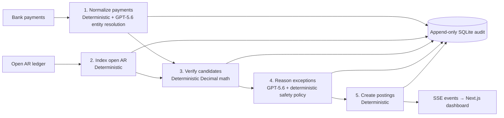

# Uniquely Architecture

This is the current technical reference for Uniquely. Its source of truth is the running code: `backend/reconciliation.py`, `backend/main.py`, and `frontend/app/page.js`. Historical narrative documents have been moved to [`archive/`](archive/) and must not be used for implementation decisions.

## System overview

Uniquely is a reasoning layer for the ambiguous portion of AR cash application. It accepts synthetic bank payments and an Open AR ledger, verifies allocations with deterministic accounting code, uses GPT-5.6 for bounded entity and routing judgment, and records every decision in an append-only SQLite journal.



## Five-agent breakdown

| Agent | Inputs → outputs | Implementation | Boundary | Example |
| --- | --- | --- | --- | --- |
| 1. Normalize payments | Raw transaction → normalized amount/currency/remittance plus resolved entity, relationship, confidence, rationale | `run_pipeline()`, `entity_catalog()`, `resolve_entity()` in `backend/reconciliation.py` | Deterministic normalization; GPT-5.6 chooses only from ledger-supplied entities | `TXN-04-005`: `T&R TRADING CO` resolves to the documented DBA for Thornton and Reed Enterprises |
| 2. Index open AR | Ledger invoices, aliases, relationship registries → normalized invoice index and entity catalog | `run_pipeline()`, `entity_catalog()` | Deterministic | Sample 04 makes parent, factoring, and intercompany relationships available to later stages |
| 3. Verify candidates | Normalized payment + indexed invoices → ordered, balanced candidate allocations and amount facts | `candidates()`, `amount_facts()`, `fx_verified()` | Deterministic `Decimal` math only | `TXN-01-002` is verified as a multi-invoice sum before any model routing |
| 4. Reason exceptions | Grounded entity result + candidates + deterministic facts → route, confidence, analyst rationale | `reason()`, `deterministic_policy()`, `enforce_auto_post_safety()` | GPT-5.6 judges ambiguity; policy and safety enforcement are hard gates | `TXN-03-001` is compliance-held even if the model would otherwise recommend posting |
| 5. Create postings | Final safe route + verified allocation → posting instruction and SSE result | `run_pipeline()` | Deterministic | `TXN-01-001` emits a posting only after the exact allocation is verified |

## How agents communicate

`POST /analyze` in `backend/main.py` creates a run ID and consumes the async generator `run_pipeline()`. Each yielded event is serialized as an SSE `data:` message. The frontend reads that stream in `frontend/app/page.js` and marks stage badges complete or appends a posting card.

```text
Dashboard → POST /analyze
  ← normalize: started / complete / entity_resolved
  ← ledger_index: started / complete
  ← match: complete (per transaction)
  ← posting: complete (per transaction, with result card)
  ← exception_reasoning: complete
  ← complete (all results)
```

Within the pipeline, each stage passes structured Python dictionaries to the next stage. The model receives only the current payment, ledger-grounded entity context, verified candidates, and deterministic amount facts; it never receives authority to create a new allocation.

## Safety architecture

### Deterministic accounting

All amounts use Python `Decimal`. Candidate verification covers invoice totals, partial balances, discounts, multi-invoice sums, credit memo netting, fee thresholds, duplicates, and FX conversion facts. GPT-5.6 does not calculate money or create invoice IDs.

### GPT-5.6 judgment

The standard OpenAI Python SDK calls `AsyncOpenAI.responses.create(model="gpt-5.6")` for two constrained tasks: `resolve_entity()` and `reason()`. Entity resolution is limited to customer and alias candidates supplied by the ledger. Routing returns structured JSON for `auto_post`, `review`, `dispute`, or `compliance_hold` plus a confidence and concise rationale.

### Hard gates

`deterministic_policy()` blocks explicit compliance/legal holds, disputed invoices, duplicates, NSF returns, post-dated checks, and stale checks. `enforce_auto_post_safety()` is the last gate.

#### Worked safety example: unsafe auto-post prevention

An earlier defect allowed GPT-5.6 to recommend `auto_post` when no verified invoice was available. The root cause was that `PARTIAL` invoices were excluded from matching and the model route had no final allocation gate. The fix makes remaining balances on `PARTIAL` invoices eligible and forces every model `auto_post` recommendation to `review` unless a deterministic candidate has at least 95% confidence. Regression tests cover this case; all ten samples were audited with no unsafe auto-post remaining.

## Edge-case coverage (34 total)

The original category counts total 34 scenarios. All are represented with synthetic data and map to the following sample transactions.

### Amount mismatches

| Scenario | Sample transaction |
| --- | --- |
| Exact match | `TXN-01-001` |
| Multi-invoice | `TXN-01-002` |
| Early-pay discount | `TXN-01-003` |
| Unauthorized short pay | `TXN-02-005` |
| Freight deduction | `TXN-02-002` |
| Damage claim | `TXN-02-003` |
| Overpayment | `TXN-08-001` |
| Credit memo net | `TXN-08-002` |
| Wire-fee write-off | `TXN-01-004` |
| Late discount taken | `TXN-02-007` |

### Identity and name

| Scenario | Sample transaction |
| --- | --- |
| SWIFT 35-character truncation | `TXN-09-001` |
| DBA name | `TXN-09-002` |
| Post-acquisition name change | `TXN-09-003` |
| Fuzzy name alias | `TXN-09-007` |

### Multi-entity

| Scenario | Sample transaction |
| --- | --- |
| Parent pays for subsidiary | `TXN-04-001` |
| Third-party factoring agent | `TXN-04-002` |
| Intercompany netting | `TXN-04-003` |
| Wrong legal entity redirect | `TXN-03-003` |

### Timing and sequencing

| Scenario | Sample transaction |
| --- | --- |
| Duplicate payment detection | `TXN-06-005` |
| Installment / partial payment | `TXN-01-007` |
| NSF return and reversal | `TXN-06-003` |
| Post-dated check hold | `TXN-06-001` |
| Stale check return | `TXN-06-002` |
| Prepayment / advance deposit | `TXN-06-007` |

### Remittance and reference

| Scenario | Sample transaction |
| --- | --- |
| No remittance → FIFO match | `TXN-01-005` |
| Vague remittance → amount match | `TXN-07-002` |
| PO number reference | `TXN-01-006` |
| Legacy ERP invoice number | `TXN-07-003` |
| EDI 820 remittance pending | `TXN-07-004` |

### FX and international

| Scenario | Sample transaction |
| --- | --- |
| Foreign-currency payment | `TXN-05-001` |
| FX-rate verification | `TXN-05-003` |

### Compliance and legal

| Scenario | Sample transaction |
| --- | --- |
| OFAC / sanctions hold | `TXN-03-001` |
| Disputed invoice payment block | `TXN-03-002` |
| Legal-hold escalation | `TXN-03-004` |

## Audit and observability

`AuditLog` stores `payments_normalized`, `entity_resolved`, `candidates_verified`, `route_decided`, and `posting_instruction` events in `backend/data/audit.sqlite3`. SQLite triggers reject `UPDATE` and `DELETE` against `audit_events`.

Live server logs emit masked GPT-5.6 call/response events with a transaction ID, masked payer preview, relationship or route, and confidence. They exclude full payer names, remittance, prompts, response bodies, and secrets.

## Deployment architecture

```text
Browser
  → Vercel: Next.js dashboard
       → hosted FastAPI backend
            → OpenAI API (GPT-5.6)
            → SQLite audit file
```

- The frontend is deployed to Vercel. `NEXT_PUBLIC_API_URL` targets the backend; `BACKEND_URL` supports the Next.js `/api` rewrite.
- The backend is deployed to Railway from `backend/`. Its Docker command binds Uvicorn to `0.0.0.0:$PORT`; `/health` is the health endpoint.
- `OPENAI_API_KEY` exists only as a deployment environment variable. `CORS_ORIGINS` is a comma-separated allowlist containing the production frontend origin. Neither is committed.

## Limitations

- FX verification uses deterministic Python `Decimal`, not the hosted OpenAI Code Interpreter tool.
- All demo inputs are synthetic; no real financial data is included.
- There is no live ERP, bank, payment-network, sanctions-screening, or identity-provider integration.
- The append-only audit file is local SQLite for the demo; a production implementation would require managed storage, access controls, retention policy, and operational monitoring.

## Positioning alongside ERP cash application

SAP and Oracle Fusion already automate easy exact matches. Uniquely is not a replacement for an ERP ledger or workflow. It is a reasoning layer for the ambiguous minority of payments—factoring relationships, DBA aliases, truncated names, uncertain remittance, and similar cases—that otherwise enter a manual exception queue. It provides a grounded rationale and audit traceability while deterministic controls keep financial allocation and policy enforcement safe.
